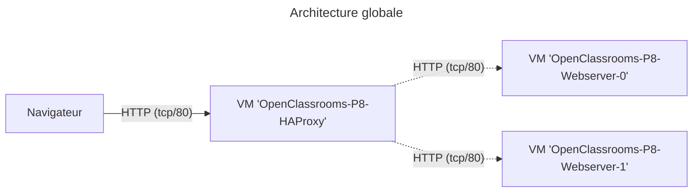

# Exercice 2 - Option "AWS"



## Démarrer

1. Avec un terminal, se positionner dans le répertoire `exo-2/aws`
2. Exécuter la commande suivante:

   ```bash
   export AWS_ACCESS_KEY_ID=<votre_identifiant_aws>
   export AWS_SECRET_ACCESS_KEY=<votre_secret_aws>
   terraform init
   terraform apply
   ```

   Une fois le déploiement terminé, vous devriez voir des messages de ce type s'afficher dans votre terminal:

   ```bash
   Apply complete! Resources: 7 added, 0 changed, 0 destroyed.

   Outputs:

   haproxy_http = <<EOT
   Pour accéder au load-balancer:
       http://<id>.compute-1.amazonaws.com
   EOT
   haproxy_ssh = <<EOT
   Pour se connecter au serveur 'haproxy':
       ssh -i <path>/.ssh/aws_openclassrooms_devops_p8.pem -o IdentitiesOnly=yes ubuntu@<id>.compute-1.amazonaws.com
   EOT
   webserver_ssh = {
   "OpenClassrooms-P8-Webserver-0" = <<-EOT

   Pour se connecter au serveur:
       ssh -i <path>/.ssh/aws_openclassrooms_devops_p8.pem -o IdentitiesOnly=yes ubuntu@<id>.compute-1.amazonaws.com
   EOT
   "OpenClassrooms-P8-Webserver-1" = <<-EOT

   Pour se connecter au serveur:
       ssh -i <path>/.ssh/aws_openclassrooms_devops_p8.pem -o IdentitiesOnly=yes ubuntu@<id>.compute-1.amazonaws.com
   EOT
   }
   ```

3. Connectez vous sur le serveur HAProxy en SSH avec la commande proposée.
4. Le fichier de configuration HAProxy est accessible avec le chemin `/etc/haproxy/haproxy.cfg`. Une fois les modifications apportées à la configuration de celui ci, il devrait être accessible à l'adresse HTTP affichée précédemment.

## Commandes utiles

### Nettoyer son environnement après l'exercice

> **Attention !** Si vous oubliez de supprimer votre environnement à la fin de l'exercice il est possible que des frais supplémentaires vous soient facturés par la plateforme AWS !

```bash
terraform destroy
```

### Retrouver les informations d'accès aux machines

```bash
terraform show
```

### Redémarrer le service HAProxy

Sur le serveur HAProxy:

```bash
sudo systemctl restart haproxy
```

### Visualiser les logs du service HAProxy

Sur le serveur HAProxy:

```
sudo journalctl -xf haproxy
```
